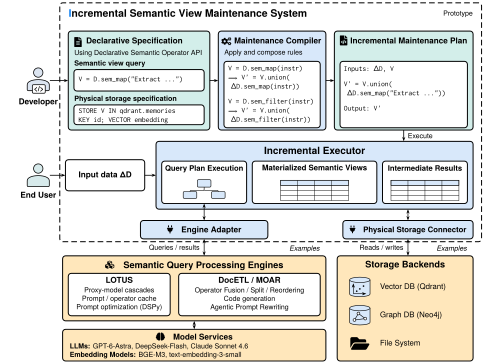

# Agent Memory

Agent Memory expresses persistent agent memory as semantic views over incoming
messages. Declare extraction, grouping, consolidation, and retrieval with a
DataFrame-style API; the framework compiles a maintenance plan and updates the
views as new messages arrive.

The repository includes Claude-style topic memory, Mem0-style fact memory, and
Zep-style graph memory, plus shared benchmark runners for LOCOMO, LongMemEval,
and MemoryAgentBench.



## Install

Use Python 3.12 or later and [uv](https://docs.astral.sh/uv/). From this checkout:

```bash
uv sync --frozen
```

For benchmarks, install the dependencies for the selected memory:

```bash
# Claude and Zep benchmark environment
uv sync --frozen --extra benchmarks --extra zep

# Separate Mem0 benchmark environment
UV_PROJECT_ENVIRONMENT=.venv-mem0 uv sync --frozen --extra benchmarks --extra mem0
```

Zep requires a running Neo4j instance. Mem0 uses local Qdrant storage.
See the [experiment guide](tools/evaluation/README.md) for setup.

## Configure credentials

Copy [.env.example](.env.example) to a local `.env` and set
`DEEPSEEK_API_KEY`. Keep credentials out of version control. Commands can load
this file explicitly with `uv run --env-file .env`.
Only Zep benchmarks require the Neo4j variables in that file.

## Use a memory

The following example performs real model calls when run:

```python
import agent_memory as am
from agent_memory.adapters.lotus import LotusAdapter

memory = am.ClaudeMemory(
    adapter=LotusAdapter(model="deepseek/deepseek-flash")
)
memory.add(am.Message(
    content="Remember that the API tests require a local Redis instance.",
    role="user",
    timestamp="2026-01-01T09:00:00Z",
))
context = memory.query("What do I need before running the API tests?")
print(context)
```

`add()` maintains the declared views. `query()` retrieves context from them;
it does not generate an answer. Applications can pass that context to their
own answerer.

Inspect the built-in Claude policy and its compiled plan **without model calls**:

```bash
uv run python examples/claude/interface_smoke.py
```

To define your own memory, start with the
[Operator API](docs/design/operator-api.md) and
[grouped aggregation guide](docs/design/groupby_agg.md).

## Run a benchmark

All three runners use the same workflow: prepare a bundle, choose a system,
run it, then inspect metrics. For a small LOCOMO integration run:

```bash
uv run --extra benchmarks --extra zep python tools/evaluation/locomo.py prepare \
  --smoke --bundle-dir .memory-test/bundles/locomo-smoke

uv run --env-file .env --extra benchmarks --extra zep \
  python tools/evaluation/locomo.py run \
  --bundle-dir .memory-test/bundles/locomo-smoke \
  --memory-model deepseek/deepseek-flash \
  --answer-model deepseek/deepseek-flash \
  --judge-model deepseek/deepseek-flash \
  --system claude-memory --output-dir .memory-test/runs/locomo-claude
```

Preparation may download data. Running invokes paid APIs.
Supported system selectors are `claude-memory`, `zep-memory`,
`mem0-memory`, and `mem0-enhanced`. Use a separate output directory per
condition and the corresponding dependency/storage setup.

The [experiment guide](tools/evaluation/README.md) covers all benchmarks,
system selection, checkpoints, scoring, and native-system comparisons.
Use the guide's dataset selectors to run complete benchmark samples.

## Documentation

| Guide | Contents |
| --- | --- |
| [Operator API](docs/design/operator-api.md) | Memory definitions, relational and semantic operators, windows, retrieval |
| [Architecture](docs/architecture.md) | Compilation, execution, storage, and retrieval |
| [Configuration](docs/configuration.md) | Models, execution controls, caching, storage, and recovery |
| [Experiments](tools/evaluation/README.md) | Dataset preparation, shared runners, metrics, and comparison |
<!-- | [Grouped aggregation](docs/design/groupby_agg.md) | Group keys, semantic outputs, deterministic aggregates, maintenance | -->

## Development checks

```bash
uv run python -m pytest
uv run ruff check src tests tools
uv run pyright
```

Live integration tests require explicit credentials and opt-in settings;
ordinary API and planner checks do not require a model endpoint.
